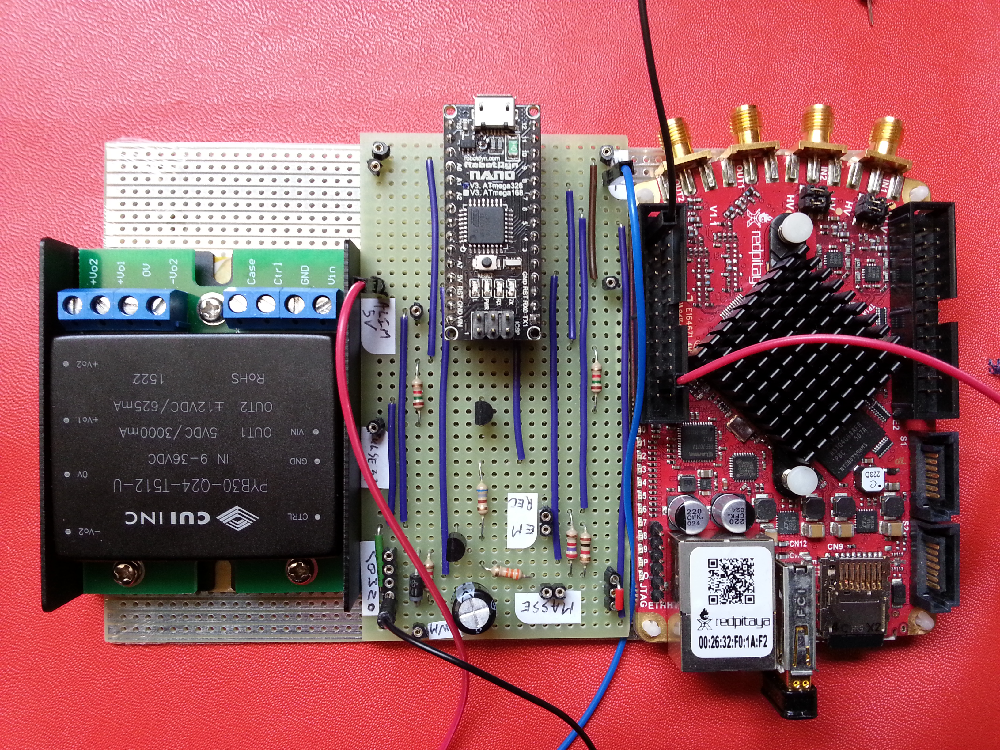

# [CFG-probe_mono_ecp]() configuration

## Title
Probe mono frequency produced by echOpen

## Description

## Uses
* [MDL-alimentation_high_voltage](../../modules/MDL-alimentation_high_voltage)
* [MDL-alimentation_low_voltage](../../modules/MDL-alimentation_low_voltage)
* [MDL-controller_arduino](../../modules/MDL-controller_arduino)
* [MDL-mechanism_cc_motor_mono](../../modules/MDL-mechanism_cc_motor_mono)
* [MDL-pulser](../../modules/MDL-pulser)

