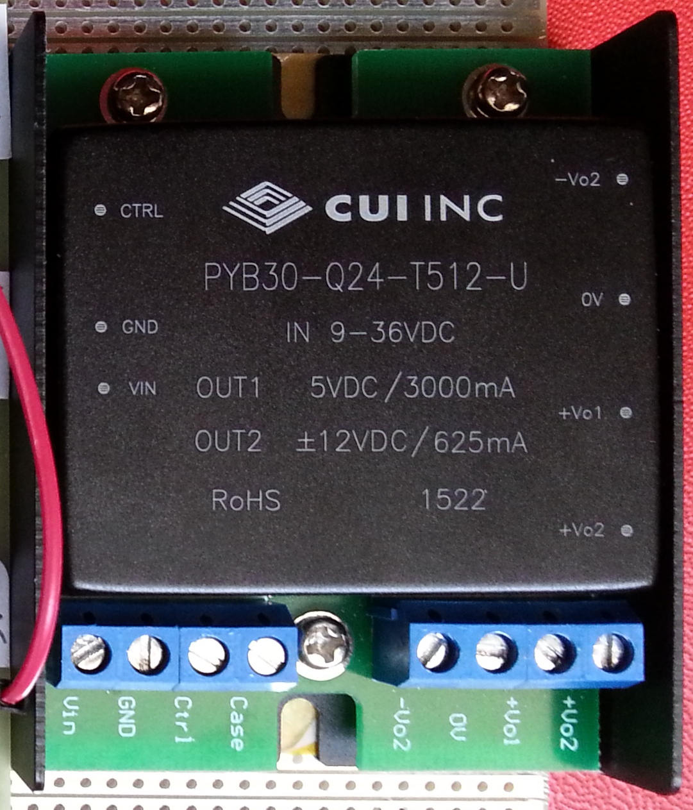

# [MDL-alimentation_low_voltage]() module

## Title
Low voltage (+5v, +3.3v, ...) alimentation

## Description

## Uses
* external +5v

## Produce
* [ITF-10-gnd](../../interfaces/ITF-10-gnd)
* [ITF-30-5_v](../../interfaces/ITF-30-5_v)

## Functions
* TODO, ex : [FCT-sensing](../../functions/FCT-sensing)
