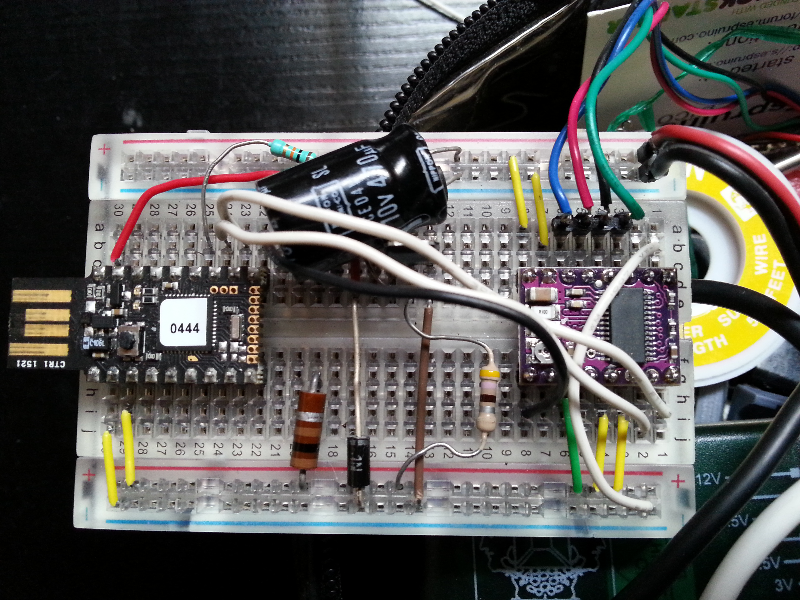

# [MDL-controller_espruino_cc]() module

## Title
Espruino µC with E/S for driving CC motor

## Description

## Uses
[ITF-10_gnd](../../interfaces/ITF-10_gnd)

## Functions
TODO, ex : [FCT-sensing](../../functions/FCT-sensing)
