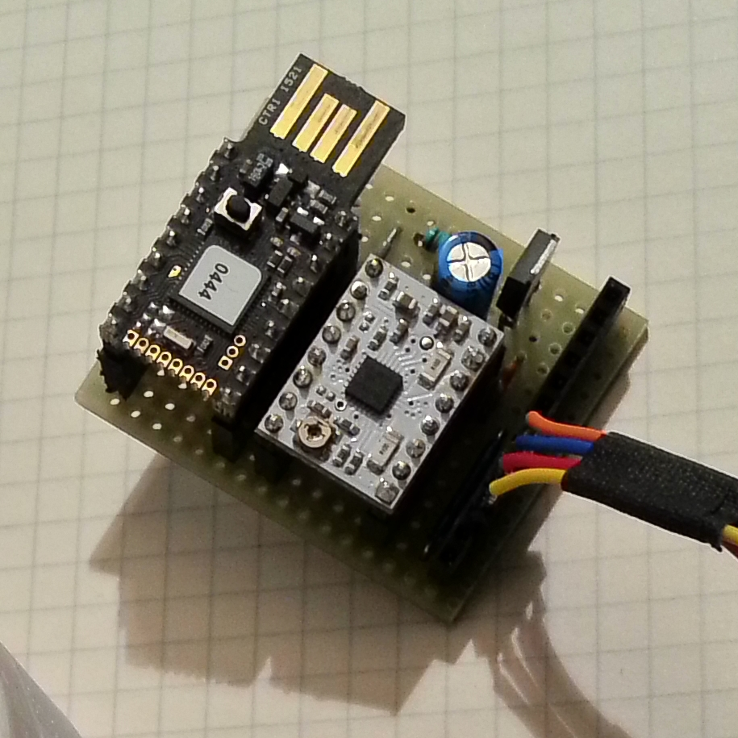

# [MDL-controller_espruino_stepper]() module

## Title
Espruino µC with driver for stepper motor

## Description

## Uses
[ITF-10-gnd](../../interfaces/ITF-10-gnd)

## Functions
TODO, ex : [FCT-sensing](../../functions/FCT-sensing)
