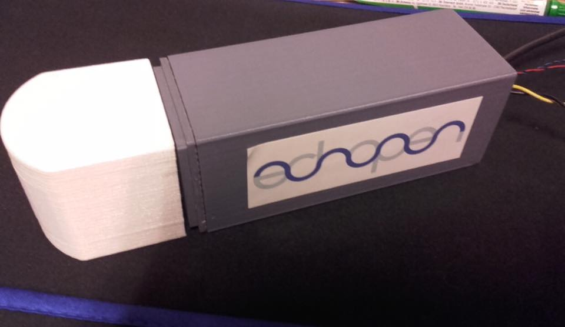

# [MDL-mechanism_cc_motor_mono]() module

## Title
Mono frequency mechanism using CC motor

## Description

## Uses
[ITF-10-gnd](../../interfaces/ITF-10-gnd)

## Functions
TODO, ex : [FCT-sensing](../../functions/FCT-sensing)
