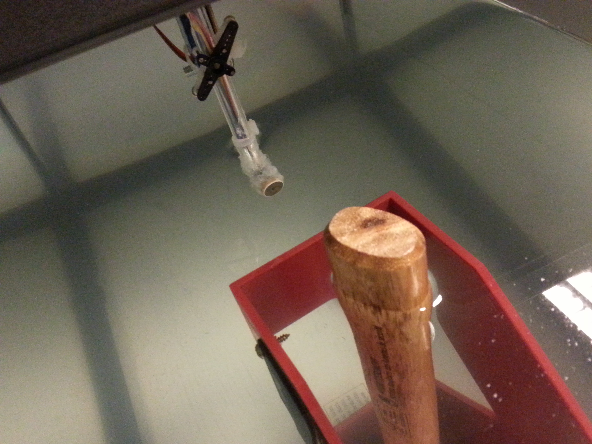

# [MDL-mechanism_servo]() module

## Title
Experimental mechanism using servo motor

## Description

## Uses
[ITF-10-gnd](../../interfaces/ITF-10-gnd)

## Functions
TODO, ex : [FCT-sensing](../../functions/FCT-sensing)
