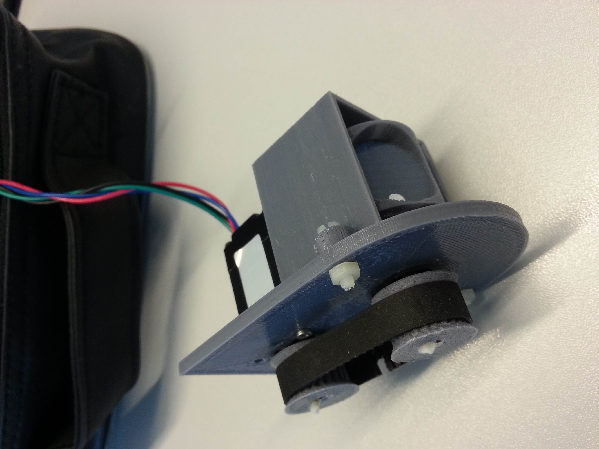

# [MDL-mechanism_stepper_timing_belt]() module

## Title
Tri frequencies stepper compact mechanism using timing belt

## Description

## Uses
[ITF-10_gnd](../../interfaces/ITF-10_gnd)

## Functions
TODO, ex : [FCT-sensing](../../functions/FCT-sensing)
